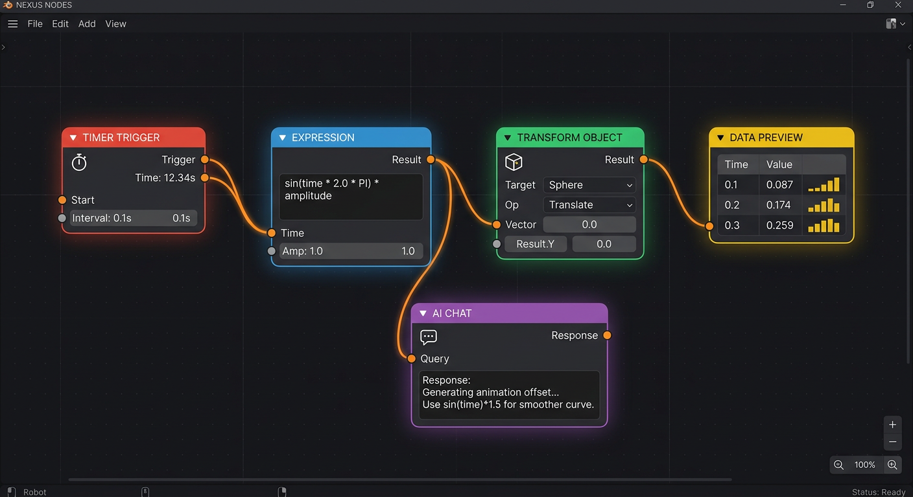

# NEXUS Nodes — Blender 的事件驱动脚本/表达式节点系统

> 触发器 → 逻辑/表达式 → 动作。内置数据预览、安全表达式沙箱、可插拔 AI 接口，
> 为"下一代 Blender 节点插件"而设计。Blender 4.3+。



## ✨ 它能做什么

- **多种触发器**：定时触发、帧触发、按键触发、点击触发、场景事件、启动、手动。
- **脚本表达式节点**：在**安全沙箱**里写 `sin(time)*amp`、`clamp(...)` 这类表达式驱动一切。
- **逻辑节点**：分支(If)、门(Once/Throttle/EveryN)、计数器、数学、延迟(非阻塞)。
- **动作节点（建模 + 动画）**：变换、插关键帧、生成基本体、加修改器、可见性、打印。
- **数据预览器**：把流经的信号实时画在节点体里，外加全局 Inspector 面板。
- **AI 节点（OpenAI 兼容）**：AI 对话、自然语言→受校验的安全表达式、自然语言→受校验的建模指令。
- **UI 定制**：每个节点自绘节点体；N 面板含引擎控制 / 数据巡视 / AI 设置。

## 🚀 安装

1. 把 `nexus_nodes/` 打包为 zip（或用本目录里的 `nexus_nodes.zip`）。
2. Blender → Edit → Preferences → Add-ons / Get Extensions → Install from Disk。
3. 新建一个 **NEXUS Logic** 节点编辑器（编辑器类型下拉里）。
4. 偏好设置里填 AI Base URL / Key / Model（可选；支持 OpenAI、Ollama、各类兼容服务）。

## 🧪 上手（30 秒）

在 Blender 文本编辑器里运行：
```python
from nexus_nodes.examples import build_all
build_all()   # 生成 4 个示例节点图
```
然后打开任一示例图，在 N 面板 **NEXUS → Engine → Start**。
- *Pulsing Cube*：物体随时间正弦脉动。
- *Key Spawner*：按空格生成一排方块。
- *Frame Keyframer*：播放时间线时把程序化运动烘焙成关键帧。
- *AI Modeling*：输入指令 → Plan → Fire，让 AI 生成几何。

## 🧩 扩展（核心零改动）

新增一个节点只要一个被装饰的子类：
```python
from nexus_nodes.core.base import NexusActionNode
from nexus_nodes.core.registry import register_node

@register_node
class WobbleNode(NexusActionNode):
    bl_idname = "NexusWobble"; bl_label = "Wobble"; category = "Action"
    def init_sockets(self):
        self.add_in_flow(); self.add_in("NexusNumberSocket", "Amount", 1.0); self.add_out_flow()
    def process(self, signal, engine):
        amt = self.input_value(engine, "Amount", signal)
        # ... 副作用 ...
        return self.flow_out(signal, wobble=amt)
```
注册表会自动把它收进添加菜单、Inspector、预览体系。

## 🏛️ 架构

见 [`ARCHITECTURE.md`](ARCHITECTURE.md)。要点：

- **push/reactive 执行模型**（与几何节点的 pull/lazy 相反）。
- `core/` 完全不依赖 bpy，可独立单元测试（`tests/test_core.py`）。
- 触发器只声明 `event_source()`，真正的 bpy handler/timer/modal 由 `core/runtime.py`
  统一注册与注销 —— **不泄漏 handler**。
- 表达式走 AST 白名单沙箱，禁 import/dunder/未授权函数。
- AI 用标准库 `urllib`，**零第三方依赖**；网络在工作线程，不卡 UI。

## ✅ 测试

```bash
python3 nexus_nodes/tests/test_core.py          # 纯核心：表达式沙箱 + 引擎 (12)
python3 nexus_nodes/tests/test_integration.py   # mock bpy 全量导入 + 注册 (7)
```

## 🛡️ 安全

- 表达式与 AI 生成的表达式都经沙箱校验后才执行。
- AI 建模指令被限制为受白名单的结构化命令，**绝不 exec 模型原文**。
- AI Key 存 AddonPreferences，不写进 .blend 文件。

## 路线图（扩展点已就绪）

- 更多动作：粒子/曲线/几何节点桥接、骨骼约束。
- 节点组/子图、可复用宏。
- AI 流式输出、本地模型、函数调用驱动节点图自构建。
- 时间轴录制 → 一键烘焙为关键帧/Action。
